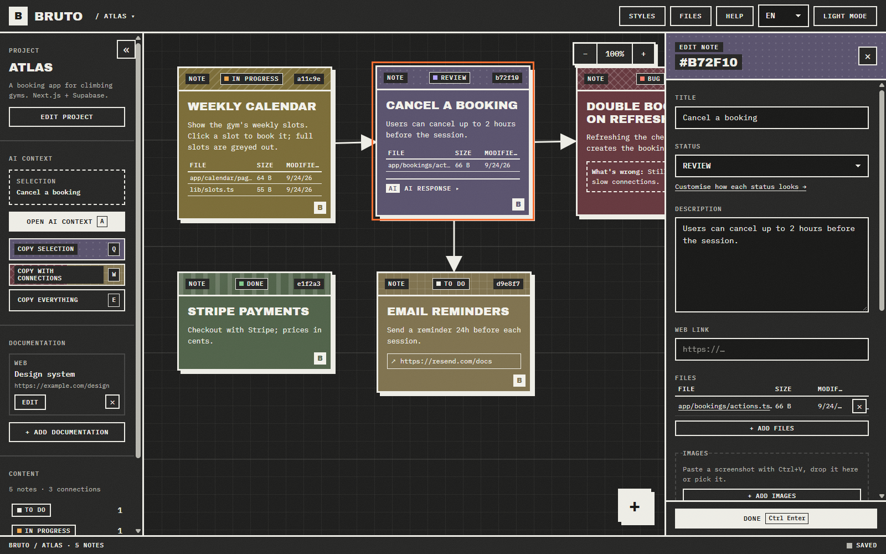
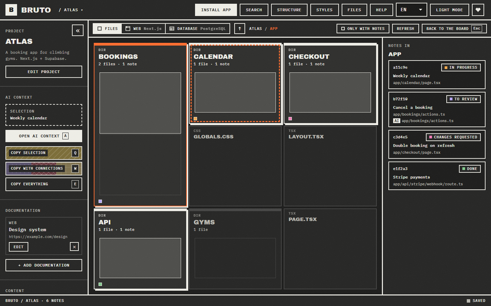
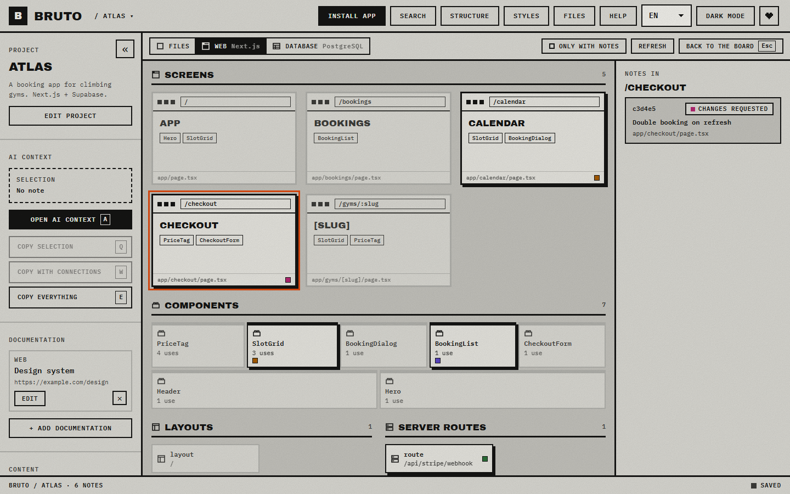
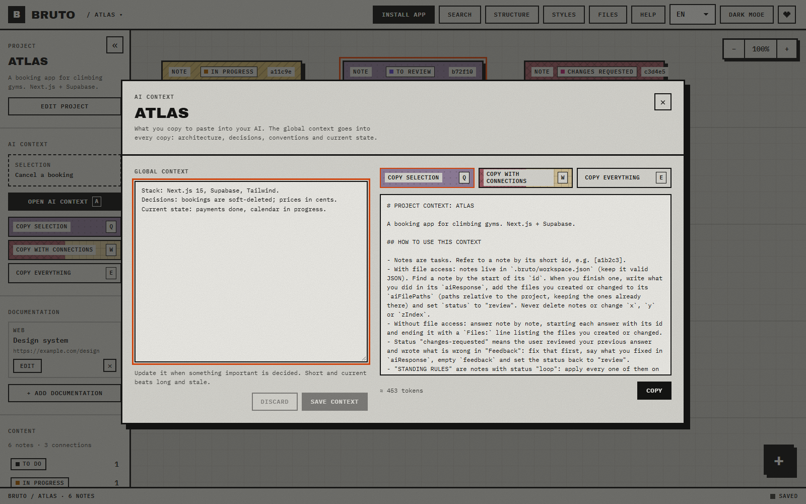
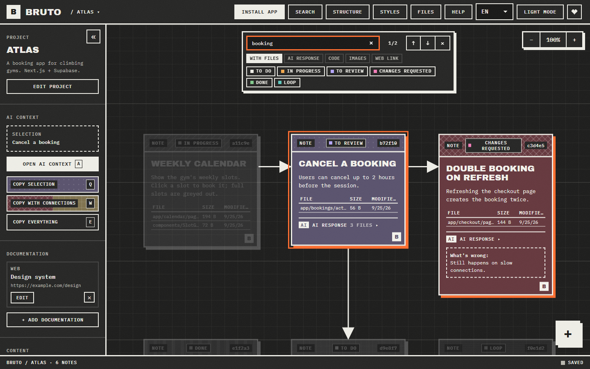

<div align="center">

# BRUTO

**A brutalist task board for projects built with AI.**
Your notes live inside the project folder, where you and any AI can read and answer them.

[**Open Bruto**](https://jimy-k4.github.io/bruto/) · No account · No server · Works offline · Anonymous visit counter only



</div>

---

## Why

Working on a project with an AI assistant means explaining the same things again and again, in a chat
that forgets. Bruto keeps the tasks of a project as notes in a file inside the project itself,
`.bruto/workspace.json`, so you and every AI you use work from the same source:

1. **You** write tasks on the board: what is wrong, which files, links, screenshots.
2. **You copy** exactly the context the AI needs with one key (`Q`, `W` or `E`).
3. **The AI** answers inside the note and marks it for review, if it can edit files. Bruto picks up
   the change live, without overwriting anything you were typing.

## Install

Nothing to download. Open **[jimy-k4.github.io/bruto](https://jimy-k4.github.io/bruto/)** in Chrome, Edge,
Brave or Opera and press **Install app** in the top bar (or the install icon in the address bar).
Bruto then opens in its own window, from the Start menu or the Dock, and works offline.

Just looking? **Try an example project** on the landing page: a small booking app with notes in every
status and code for the structure view, kept only in your browser.

Prefer to run it yourself? See [Development](#development).

## Features

- **Board.** Notes with a status, description, files, a link and screenshots. Drag them, connect them
  with arrows, select many at once and edit them together.
- **Structure view.** The project's folders and files as blocks sized by how many files they hold,
  marked with the notes that point at them. It shows where the work is, and lists links to files
  that no longer exist. _Only with notes_ hides everything no note points at, here, in the lenses and
  in the files window.
- **Search.** `Ctrl F` finds notes by text, path or id, and filters them by status and by what they
  have or lack: files, an AI response, code, images, a web link.
- **Lenses.** When Bruto recognises the project, the structure view offers it drawn by what its files
  are, still with the notes on each element:
  - **Web** (React, Vue, Svelte, Next.js, Nuxt, SvelteKit, Astro, Angular): pages as browser windows
    with their route and the components on them, a wall of components sized by use, then layouts,
    server routes, hooks, state and services.
  - **API** (.NET, NestJS, Express, Fastify, FastAPI, Flask, Spring): controllers and routers as
    resources listing their endpoints, verb, route and authorization, with the services they depend
    on; then services, repositories, data, models and middleware.
  - **Database** (Oracle PL/SQL, PostgreSQL and Supabase, plain SQL, Prisma): tables with their
    columns and keys as an entity-relationship diagram, following migrations in order; packages split
    into specification and body, row level security and its policies, then views, triggers,
    procedures, functions and sequences.
- **AI context.** Copy the selection, the selection plus everything it points to, or the whole
  project, as clean Markdown with short instructions for the model. A preview shows exactly what gets
  copied and roughly how many tokens it is.
- **Answers in the note.** Each note has an _AI response_, the files the AI touched and a _What's
  wrong_ field, so review loops stay attached to the task.
- **Safe with other tools.** Every save reads the file first and merges changes made elsewhere, note by
  note and field by field. A broken file is never overwritten: Bruto shows what is wrong and offers the
  latest backup (one is kept each time a project is opened).
- **Keyboard first and accessible.** Every action has a shortcut, notes are reachable with Tab, dialogs
  trap focus and everything has a readable name for screen readers.
- **Nine languages**, light and dark themes, a colour and pattern per status, installable, works
  offline, and tells an open window when a new version is out.
- **Local only.** The app is a static page: it has no server and no storage of its own. The published
  site only counts visits, anonymously and without cookies ([GoatCounter](https://www.goatcounter.com/)):
  nothing about your projects or notes ever leaves your browser.
  Your notes never leave your folders.

<p>
  
  
</p>
<p>
  
  
</p>

## Working with an AI

Paste the copy into any chat (Claude, ChatGPT, Gemini, DeepSeek…). It starts with instructions like
these, so the model knows how to answer:

````markdown
## HOW TO USE THIS CONTEXT

- Notes are tasks. Refer to a note by its short id, e.g. [a1b2c3].
- With file access: notes live in `.bruto/workspace.json` (keep it valid JSON). Find a note by the
  start of its `id`. When you finish one, write what you did in its `aiResponse`, add the files you
  created or changed to its `aiFilePaths` (paths relative to the project, keeping the ones already
  there) and set `status` to "review". Never delete notes or change `x`, `y` or `zIndex`.
- Without file access: answer note by note, starting each answer with its id and ending it with a
  `Files:` line listing the files you created or changed.
- Status "changes-requested" means the user reviewed your previous answer and wrote what is wrong
  in "Feedback": fix that first, say what you fixed in `aiResponse`, empty `feedback` and set the
  status back to "review".
- Put commands and code the user has to run or paste in `aiResponse` inside Markdown code blocks
  (```): the note shows each one with a copy button.
````

**Code in answers** shows in its own box with a copy button, in the note and in the editor: a command
the AI wants you to run is one click away.

**Files the AI touched** go in their own list, `aiFilePaths`, apart from the files and images you
gave the note. Reviewing an old note, what you asked for and what the AI changed stay easy to tell
apart; the structure view places both on the project map.

**Standing rules.** A note with the status **Loop** is a rule, not a task: "update the README on every
change", "run the tests before finishing". It goes into every copy under `## STANDING RULES`, even when
it isn't selected, and the model is told to apply it on each task and leave it open.

Coding agents that work in your repository can also be pointed at the file directly, for example with
one line in `AGENTS.md` or `CLAUDE.md`:

```markdown
Tasks for this project are in `.bruto/workspace.json`. Work on notes whose status is "todo", and
always apply the notes whose status is "loop".
```

## The workspace file

Plain JSON, meant to be read and edited by people and tools alike. Bruto fills in anything missing, keeps
fields it does not know about, and accepts common status words such as `"pending"` or `"completed"`.

```jsonc
{
  "version": 3,
  "title": "ATLAS",
  "description": "What the project is. Heads every copy for the AI.",
  "aiContext": "Stack, decisions, conventions, current state.",
  "documentation": [{ "id": "…", "name": "Design system", "url": "https://…", "type": "web" }],
  "notes": [
    {
      "id": "b72f10aa-…",
      "title": "Cancel a booking",
      "description": "Users can cancel up to 2 hours before the session.",
      "status": "review", // idea · todo · in-progress · review · changes-requested · done · blocked · bug · wontfix · loop
      "filePaths": ["app/bookings/actions.ts"], // relative to the project
      "webUrl": "",
      "images": [".bruto/images/b72f10-20260924-ab12.png"],
      "aiResponse": "Added cancelBooking() with the 2h rule.",
      "aiFilePaths": ["app/bookings/cancel.ts"], // what the AI created or changed
      "feedback": "Still possible after the deadline on mobile.",
      "x": 420,
      "y": 60,
      "zIndex": 2,
      "colorTheme": "plum",
      "pattern": "dots",
    },
  ],
  "connections": [{ "id": "…", "from": "<note id>", "to": "<note id>" }],
  "statusStyles": { "review": { "color": "plum", "pattern": "dots" } },
}
```

Add `.bruto/` to your `.gitignore` if the notes should stay on your machine.

## Shortcuts

| Keys                | Action                                | Keys                | Action                                         |
| ------------------- | ------------------------------------- | ------------------- | ---------------------------------------------- |
| `N`                 | New note                              | `Q` / `W` / `E`     | Copy selection / with connections / everything |
| `A`                 | AI context window                     | `C`                 | Connect the selected note                      |
| `Enter`             | Open the focused note                 | `←↑→↓`              | Move notes (`Shift` for bigger steps)          |
| `Ctrl C` / `Ctrl V` | Copy and paste notes, or a screenshot | `Ctrl D`            | Duplicate                                      |
| `Del`               | Delete (undoable)                     | `Ctrl Z` / `Ctrl Y` | Undo / redo                                    |
| `F`                 | Centre the view                       | `Alt 1…9`           | Switch open project                            |
| `M`                 | Structure view                        | `Backspace`         | Up one folder in the structure view            |
| `Ctrl F` / `/`      | Search notes (text, path or id)       | `Enter`             | Next result (`Shift` for the previous one)     |
| `0`                 | Reset zoom and position               | `Esc`               | Close or cancel                                |

Press `?` in the app for the full list.

## Browser support

Bruto opens folders with the File System Access API, available in Chrome, Edge, Brave and Opera on
desktop. Firefox and Safari can't open local folders yet.

## Development

```bash
npm install
npm run dev        # http://localhost:5173
npm run check      # format, lint, types and unit tests
npm run test:e2e   # browser tests (uses the installed Chrome)
npm run shots      # screenshots of the example project for the landing page and this README
npm run build
```

```text
src/
  domain/     pure logic: workspace format, merge, AI context, search, structure (unit tested)
  storage/    the project folder: workspace file, backups, images, recent projects
  state/      in-memory workspace with undo, and the engine that keeps it in sync with disk
  board/      the canvas: notes, connections, pan, zoom, selection, search
  structure/  the structure view and its file map
  lenses/     reading web, API and database code of many stacks, and drawing each kind
  workspace/  the project screen: actions, shortcuts, UI state
  panels/     editors and dialogs
  layout/     top bar, sidebar, status bar, landing
  shortcuts/  one keymap for the keyboard handler and the help window
  i18n/       one dictionary per language, checked by tests
  ui/         shared pieces: dialogs, toasts, pickers
  styles/     design tokens and styles
e2e/          browser tests against a real (private) file system
```

## Support

Bruto is free and has no ads, accounts or tracking. If it saves you time, you can
[buy me a coffee on Ko-fi](https://ko-fi.com/jimy_k4): it's also the heart in the top bar.

## License

[MIT](LICENSE)
